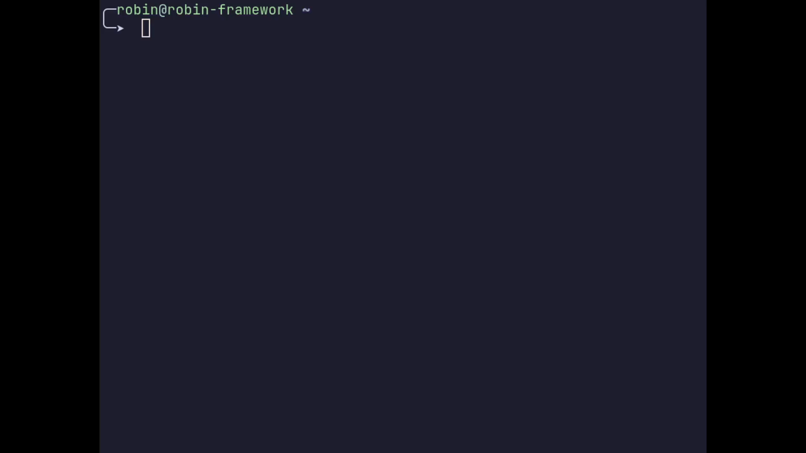

# wiretui

## Summary

A minimal keyboard-driven TUI to manage WireGuard VPN connections, heavily inspired by
[bluetui](https://github.com/pythops/bluetui) and [impala](https://github.com/pythops/impala).

## Demo



## Prerequisites

You will need to use a **Linux** based operating system using the **NetworkManager**.

## (Planned) features

- [x] list all imported connections
- [x] activate a connection
- [x] deactivate a connection
- [x] import a new connection from a config file
- [x] remove an existing connection
- [x] search connection list

## Installation

### crates.io

This installs the latest version that was released to
[crates.io](https://crates.io/crates/wiretui-bin)

```shell
cargo install wiretui-bin
```

### From source

This installs the latest version of the source code

```shell
git clone https://github.com/robin-thoene/wiretui.git
cd wiretui
cargo install --path ./crates/tui/
```

## Usage

### Starting

```shell
wiretui
```

### Keybindings

`j`: move down

`k`: move up

`SPACE`: toggle the selected connection

`?`: open the help menu

`ESC`: close a menu

`q`: quit application

`i`: open the menu to import a new connection

`CTRL+d`: delete the selected connection

`/`: search the list of imported connections

## Local development

### CLI

Run the application

```shell
cargo run --bin wiretui
```

Run the tests

```shell
cargo test
```

Check if you violated the hexagonal architecture dependency rules

```shell
./scripts/lint_architecture.sh
```

Check the workspace rules (using [cargo-deny](https://github.com/EmbarkStudios/cargo-deny))

```shell
cargo deny check
```

### Debugging

This project contains a debugger configuration using [.vscode files](./.vscode/).

## Logging

This application uses the **log** crate in combination with the **env_logger** crate to set the
log level. By default the logs are written to a file, which is overridden every time you run the
application.

You can see it's current content with

```shell
cat ~/.local/state/wiretui/log.txt
```

To override the log level when running the application use

```shell
RUST_LOG=debug cargo run
```

Valid log level are `trace`, `debug`, `info`, `warn` and `error`.

## Contributing

As of now this project is publicly available but not actively asking for or accepting pull
requests until I finished my desired MVP state. This is due to the fact that the project is part
of a university module as well as a learning opportunity for myself.

For the moment you can contribute best by:

- submitting bug reports
- reviewing code to be idiomatic, secure and performant

## License

See the [LICENSE](./LICENSE)
